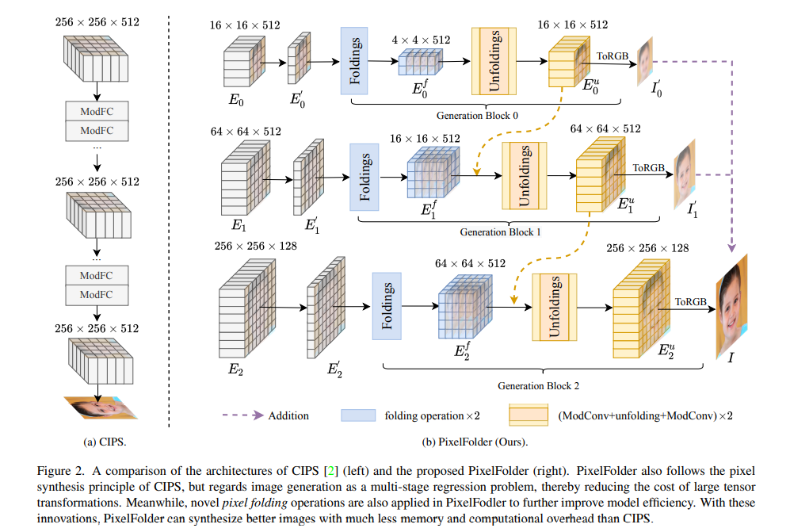

# PixelFolder
This is an official implementation of ECCV 2022 Paper ["PixelFolder: An Efficient Progressive Pixel Synthesis Network for Image Generation"](https://arxiv.org/abs/2204.00833). The proposed PixelFolder outperforms existing state-of-the-art pixel synthesis methods (e.g. CIPS, INR-GAN), while reducing the number of parameters and computational overhead by more than 50%. 


## Contents
  - [Usage](#usage)
    - [Requirements](#requirements)
    - [Data Preparation](#data-preparation)
    - [Training](#training)
    - [Evaluation](#evaluation)
  - [Model Performance](#model-performance)
  - [Checkpoints](#pretrained-checkpoints)
  - [Citation](#citation)
  - [Acknowledgement](#acknowledgement)

## Usage
### Requirements
- Install `CUDA==10.1` with `cudnn7` following the [official installation instructions](https://docs.nvidia.com/cuda/cuda-installation-guide-linux/index.html)
- Install `Pytorch==1.7.1` and `torchvision==0.8.2` with `CUDA==10.1`:
```
conda install pytorch==1.7.1 torchvision==0.8.2 torchaudio==0.7.2 -c pytorch
```
- Install other packages:
```
pip install -r requirements.txt
```


### Data Preparation
1. Please download the FFHQ or LSUN (Church/Cat/Bedroom) dataset and organize the images in `.jpg or .png` format to `DATASET_PATH`. 
    FFHQ: https://github.com/NVlabs/ffhq-dataset
    LSUN Church/Cat/Bedroom: https://github.com/fyu/lsun
  
2. Create lmdb datasets.
```
python prepare_data.py images --out LMDB_PATH --size SIZE DATASET_PATH
```
where `LMDB_PATH` is the path of the output lmdb dataset files, `SIZE` is the target resolution and `DATASET_PATH` is the source image files. 

### Training
Run the command `sh train.sh` to train the model with default hyperparameters. Note that you should first change the hyperparameter `path` to the path of your dataset.  

Args: 
- `--Generator=PixelFolder` to declare the model name. We also support training CIPS and StyleGAN2, you only need to modify the hyperparameter here.
- `--batch=int` to set the batch size. 
- `--out_path`, which is the path of output files including images, checkpoints and tensorboard files. 
- `--path_fid` to temporarily save the images generated when calculating the FID score. 


### Evaluation
- FID score
- Precision & Recall
- IS
- PPL
- number of parameters
- GMACS
- Inference Speed
  

## Model Performance
<div align=center>
</img>
</div>
<div align=center>
</img>
</div>
<div align=center>
</img>
</div>
<div align=center>
</img>
</div>
<div align=center>
</img>
</div>

## Pretrained Checkpoints
- PixelFolder_ffhq_256 [Google Driver](https://drive.google.com/file/d/1qrkATOalIw04MHKTf3tC8Oqe0POHaGo1/view?usp=sharing)
- PixelFolder_ffhq_512 [Google Driver](https://drive.google.com/file/d/1R54xHWvP-TbJp_uZFDMdec8lvtnYSISr/view?usp=sharing)
- PixelFolder_ffhq_1024 [Google Driver](https://drive.google.com/file/d/16Oi0x_t2u50HMa-ZPhRMa0uNzgYc2sjN/view?usp=sharing)
- PixelFolder_church_256 [Google Driver](https://drive.google.com/file/d/1kX9LWLpMpOnLhft2wIkIoqzjFDMO6D01/view?usp=sharing)

## Citation
If PixelFolder is helpful for your research or you wish to refer the baseline results published here, we'd really appreciate it if you could cite this paper:
```
@article{he2022pixelfolder,
  title={PixelFolder: An Efficient Progressive Pixel Synthesis Network for Image Generation},
  author={He, Jing and Zhou, Yiyi and Zhang, Qi and Peng, Jun and Shen, Yunhang and Sun, Xiaoshuai and Chen, Chao and Ji, Rongrong},
  journal={arXiv preprint arXiv:2204.00833},
  year={2022}
}
```

## Acknowledgement
Our code is built upon the [CIPS implementation](https://github.com/saic-mdal/CIPS) and [Nvidia-licensed CUDA kernels](https://github.com/NVlabs/stylegan2) (fused_bias_act_kernel.cu, upfirdn2d_kernel.cu).

## TODO

- [ ] Evaluation
    - [ ] FID\Prevision\Recall\IS
    - [ ] Params\GMACs\Speed

